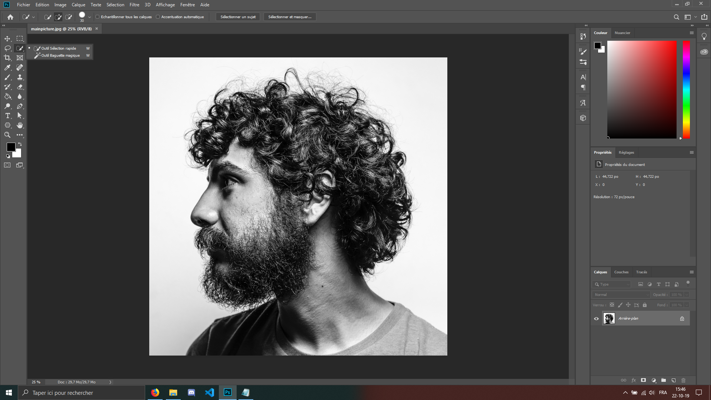
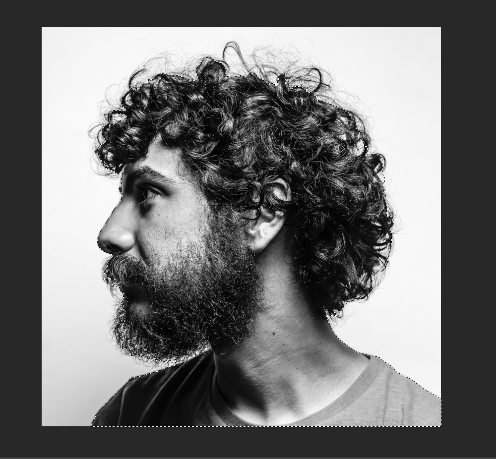
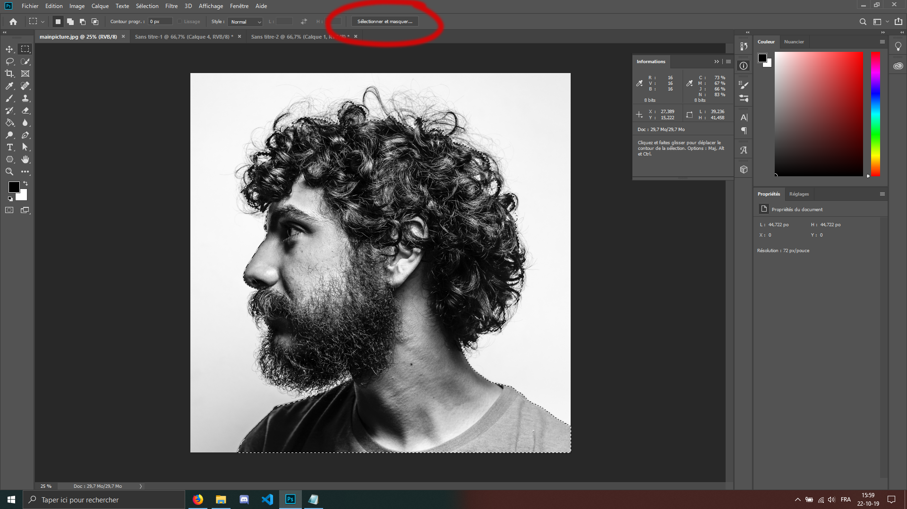
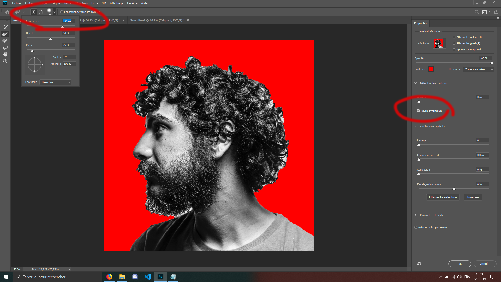
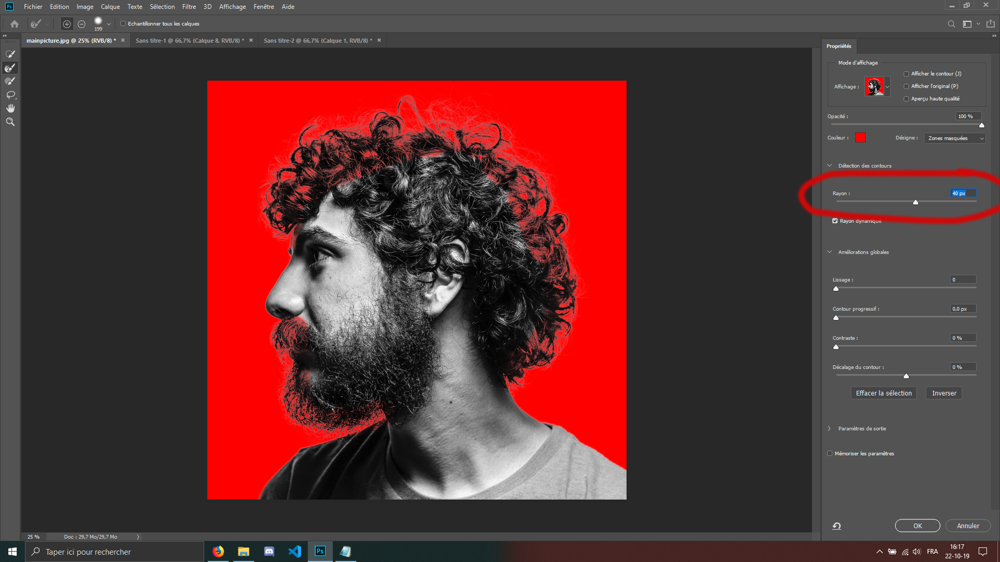

(Avant toute chose, n'hésitez pas à utiliser les raccourcis "ctrl + -" ou "ctrl + +" pour zoomer
et dézoomer. Il y a aussi le raccourci "ctrl + z" à connaitre, mais à utiliser avec parcimonie !)

 
 
Pour commencer ce montage, il vous faut... ouvrir PhotoShop !

Ouvrez l'image du premier lien, c'est-à-dire la photo de l'homme de profil.
 
 
 
 
La première étape est d'éffectuer un détourage. Nous allons séparer la personne sur la photo, du background. Pour des raisons de simplicité, nous allons utiliser l'outil de sélection rapide
 

 
 
 
 
Nous allong survoler le modèle approximativement, pour que ça ressemble à ceci :

Sur l'image ce n'est pas très perceptible mais on voit le trait de sélection, si l'on prête attention.
 
 
 
 
Ensuite, cliquez sur "Selectionner et masquer"
 

Cela va nous permettre d'améliorer la selection des cheveux, avec plus de précision.
 
 
 
 
Cochez la case rayon dynamique et n'hésitez pas à augmenter la taille de votre outil.

Ensuite passons sur les cheveux et la barbe (vers l'extérieur) pour récupérer la sélection sur ces cheveux et poils de barbe que nous n'avions pas selectionner avec l'outil sélection rapide.
 
 
 
 
Ensuite, sur la droite du logiciel, mettez votre "Rayon ou Radius" à environ 40 pixel, pour améliorer davantage la sélection pour avoir un résultat à peu près comme celui-ci :

 
 
 
 
Cliquez sur "Ok". Nous avons une selection, mais maintenant nous voulons appliquer le masque calque dessus.

<a href="Ws-Ps-4.md">La suite ici -></a>