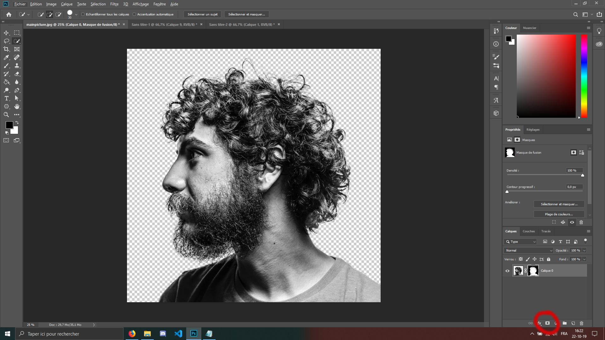
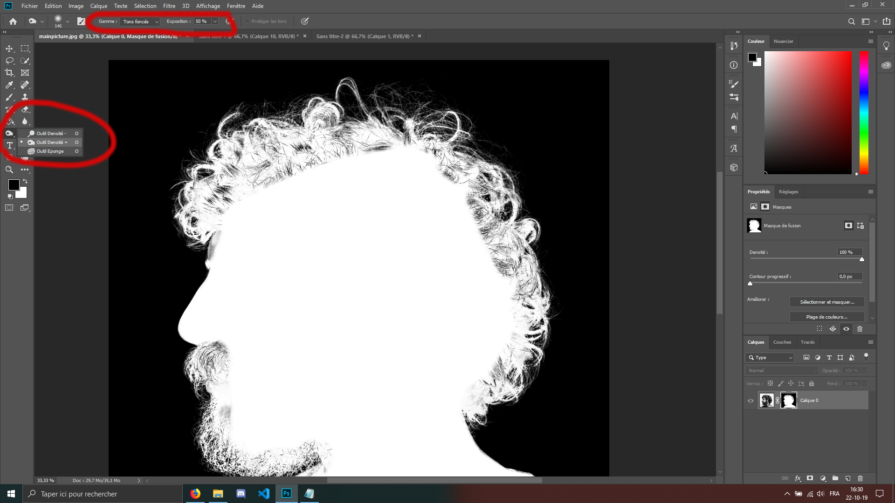
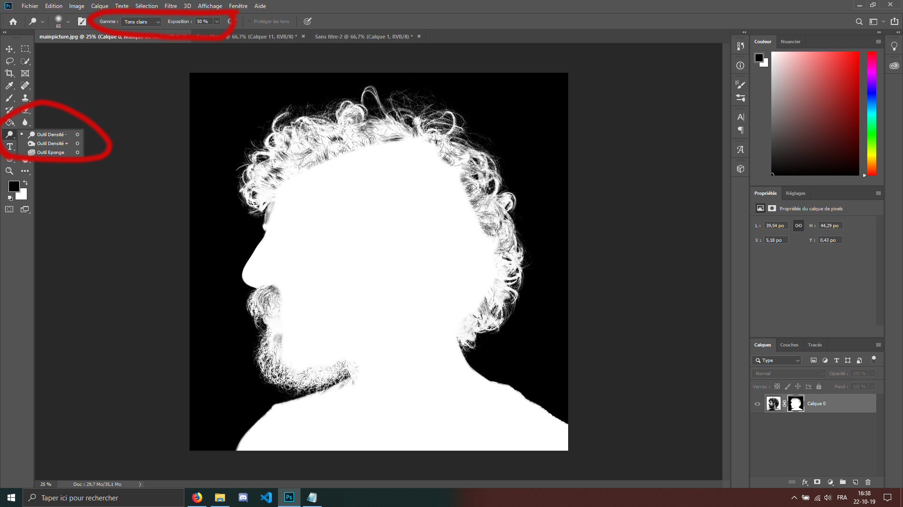
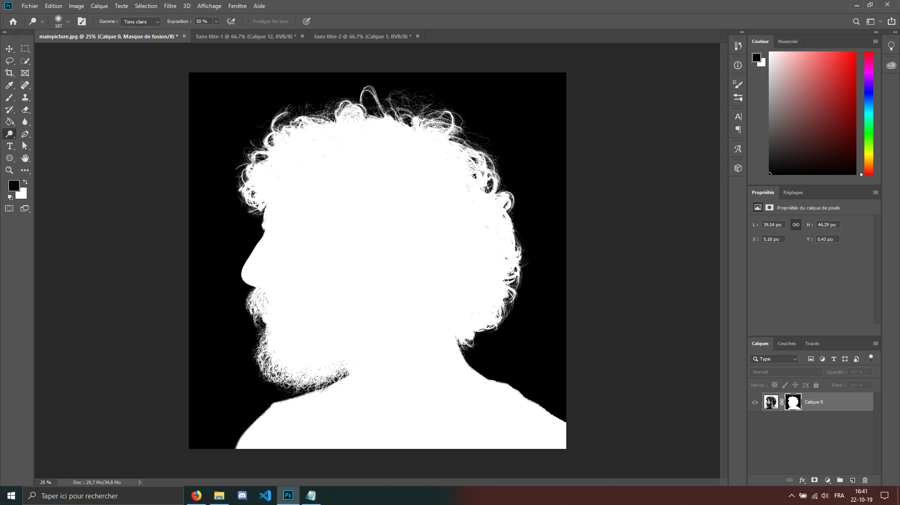

Cliquez sur le bouton qui est entouré sur le screen, ce qui devrait donner le même résultat qu'au-dessus.
 
Maintenant faites un Alt+Clic sur la forme en noir et blanc qui est apparue à côté de notre calque, ce qui nous permet d'entrer dans le mode masque de fusion.
 
 
 
 
Nous allons maintenant enlever  toute les zones 'grises' que l'on peut voir. Pour se faire, nous allons utiliser deux outils :
 
 
- Premier outil :
 

Si vous avez des zones grises EN DEHORS de la selection, c'est-à-dire sur l'extérieur du visage,sélectionnez l'outil "Densité +" et réglez sur "Tons foncés", avec une exposition de 40 à 50%.
 
 

Ce n'est pas mon cas mais je sais que c'est possible.Si c'est le cas repassez donc sur ces zones qui sont en dehors de la sélection, afin qu'il ne reste plus que du noir à ces endroits.

 
   

- Deuxième outil :

Sélectionnez l'outil "Densité -" et nous allons faire la
même chose mais cette fois-ci à l'intérieur de la selection (donc dans le visage). Faites attention à bien sélectionner "Tons clairs" avec aussi une exposition de 40-50%

 
 
 
 
Pour avoir un résultat proche de celui-ci :

 
 
Maintenant nous pouvons recliquer sur notre calque image de base, à gauche de celui de sélection, pour nous faire quitter le mode masque de fusion et retourner sur notre image de base, avec notre fond en transparent (si c'est un quadrillage gris et blanc, c'est bien transparent.).

<a href="Ws-Ps-5.md">On continue -></a>