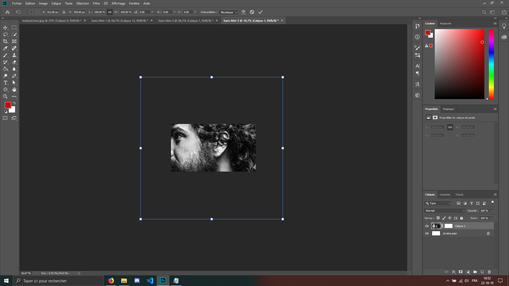
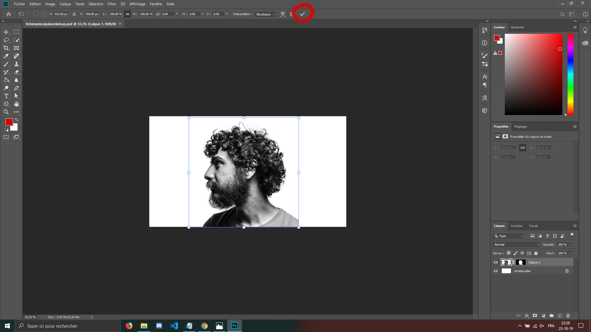
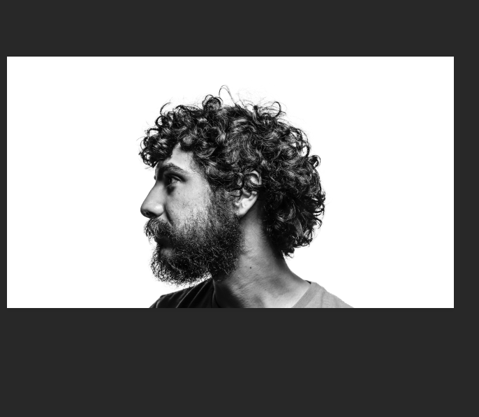
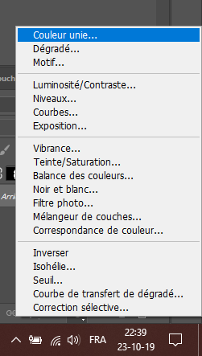
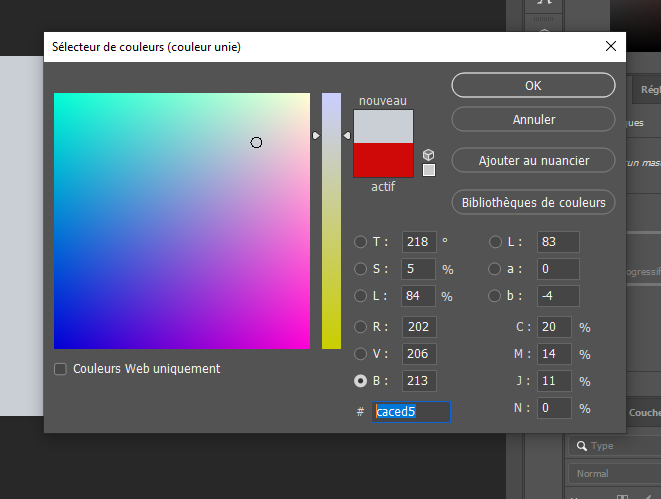
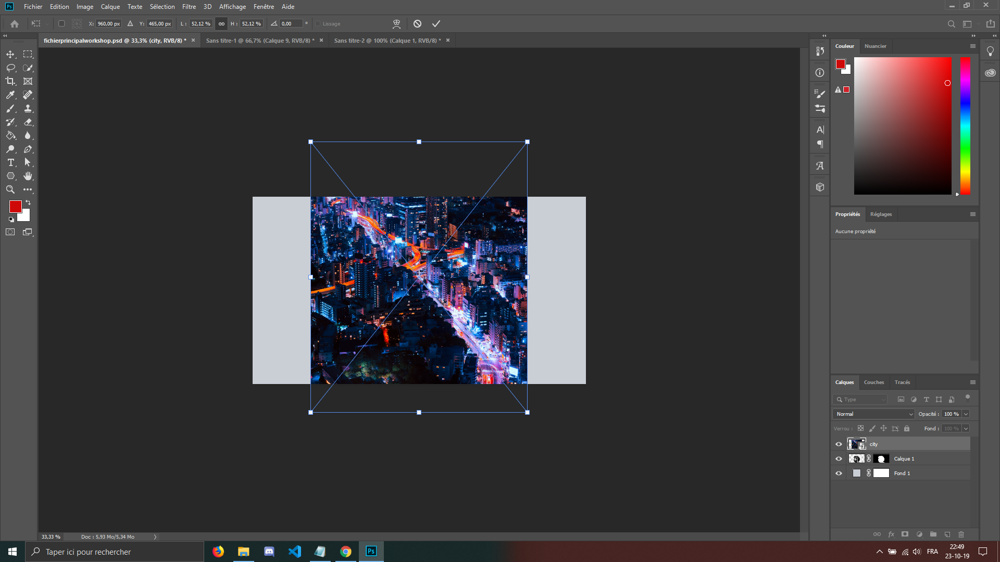
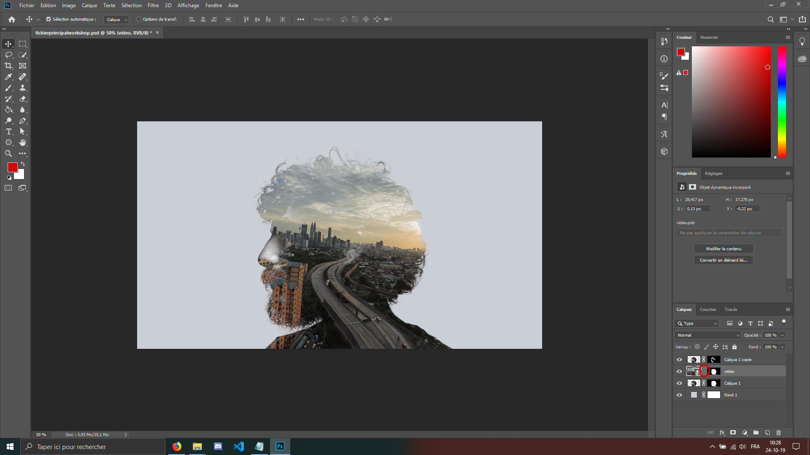

Maintenant allons créer un nouveau fichier.
Donc fichier -> nouveau (ou ctrl+N) avec les caractéristiques suivantes :

Largeur : 1920 pixels 
Hauteur : 1080 pixels 
Résolution : 300 
Mode colorimétrique : Couleur RVB, 8 bits 
Contenu de l'arrière-plan : Blanc
 
 

Une fois ce fichier créé et ouvert dans Photoshop, nous allons prendre l'outil de déplacement, qui est le raccourci " V ", et déplacer notre photo vers le nouveau fichier. 
Une fois fait, vous allez constater que la photo est bien trop grande par rapport à notre nouveau fichier. Surtout ne paniquez pas.
Faites un ou plusieurs "ctrl + -" pour dézoomer beaucoup, suivi d'un ctrl+T.
 

 
 
Ensuite, vous allez vers l'un des coins du rectangle de selection qui entoure notre photographie et, tout en restant appuyé sur la touche "alt", vous allez réduire sa taille avec votre souris pour arriver à ce résultat :

Validez avec la touche "enter" ou bien en cliquant sur le 'V' en haut.
 
 
 
 
N'hésitez pas à le baisser davantage hors du cadre afin que les épaules n'aient pas l'air d'être découpées.

 
 
 
 

Nous allons maintenant créer un nouveau background pour notre photo.
Selectionnez le calque du background(celui juste en-dessous du calque où l'on est) en cliquant dessus, ensuite cliquez sur l'îcone en bas à droite, qui est juste à droite de l'outil masque que nous avons utilisé précédemment, et choisissez 'couleur unie'.

 

 
 
 
 

Mettez une couleur grise légèrement bleutée, notez la même référence que moi sur le screenshot ci-dessous.

 
 
 
 
Ensuite faites glisser l'image de la ville dans Photoshop, faites un ctrl+T et restez appuyer sur la touche
alt pour redimensionner un peu la ville. 
Placez là comme bon vous semble tant qu'elle recouvre
complètement notre modèle.

 
 
 

**POUR CEUX QUI FONT LE TUTO ANIMÉ :**

 
Veuillez glisser la vidéo dans Photoshop, redimensionnez là, et placez là de sorte à ce que la route soit vraiment l'élément central, et qu'elle s'aligne avec la ligne de l'épaule de notre modèle. Pour la suite, continuez le tuto jusqu'à la fin.
Aussi, cliquez sur le 'link' entre le masque et l'image que vous ajoutez à l'étape suivante, pour
pouvoir bouger la vidéo indépendamment du masque de fusion.

<a href="photoshop-readme/Ws-Ps-6.md">Vous suivez toujours ? Ne lâchez rien -></a>