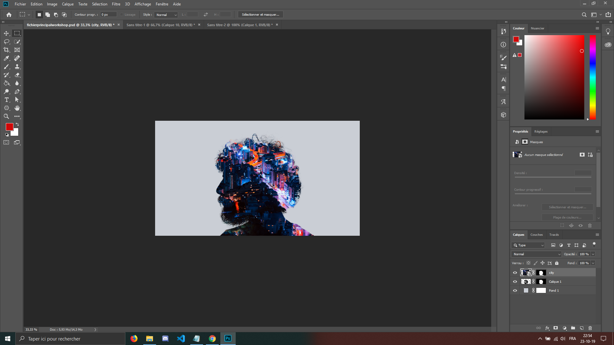
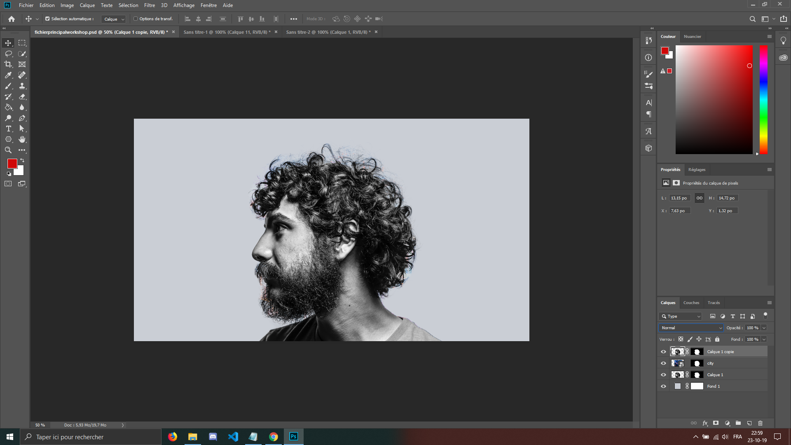
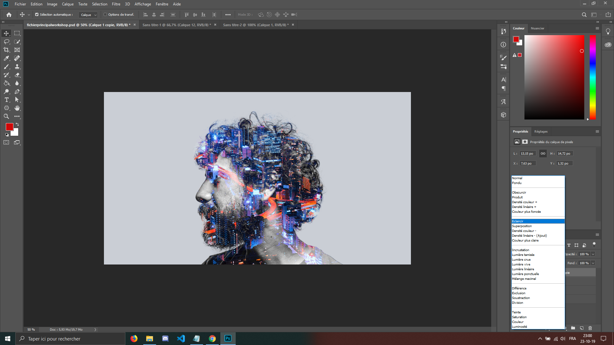
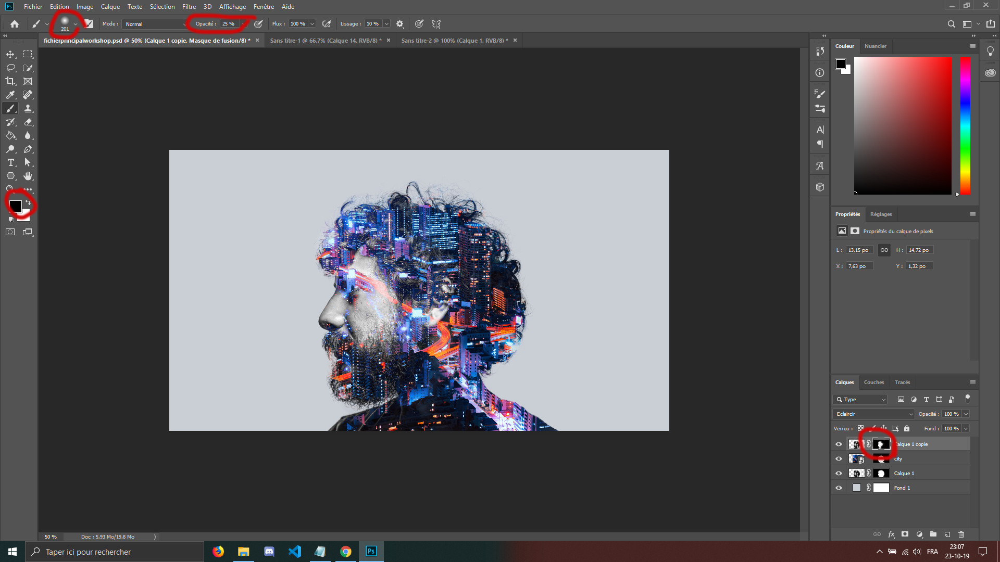
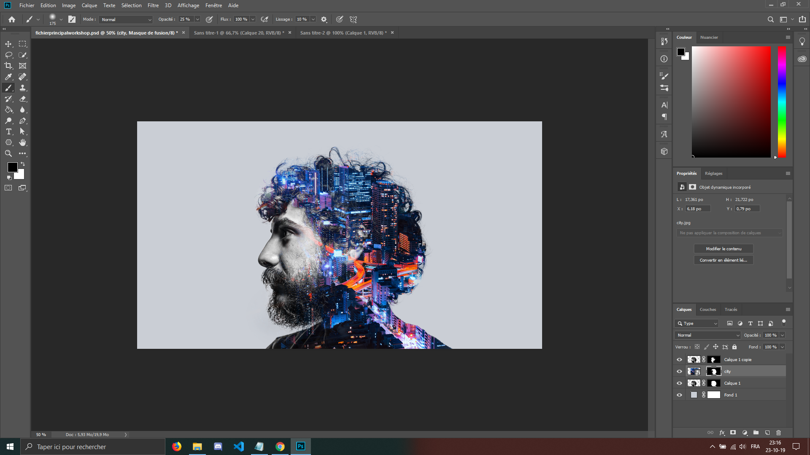
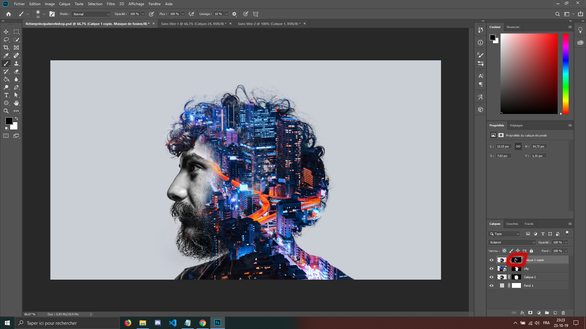

Ensuite, nous allons appliquer le même masque de selection que nous avons sur notre calque avec notre modèle. Mettez votre souris par dessus le masque, et maintenez la touche alt enfoncée et faites le glisser sur le calque avec la photographie/vidéo de la ville.
 
 
 
 
Vous devriez avoir ce résultat :

 
 
 
 
Ensuite, nous allons créer une copie de notre calque avec la photographie, en pressant sur la touche alt et en le faisant glisser tout au dessus des autres calques.

 
 
 
 
Ensuite, cliquez sur le 'normal' (le menu à gauche de 'opacité') situé au dessus du calque, et choisissez l'option 'éclaircir'.
 

 
 
 
 
Nous allons ensuite séléctionner le masque du calque sur lequel nous venons d'appliquer 'éclaircir', prendre un pinceau normal (raccourci B), la couleur noire et environ 25% d'opacité.
N'hésitez pas à augmenter la taille de votre pinceau pour plus de facilité et de rapidité. Nous allons repasser sur le côté droit de l'image pour que nous ne voyons plus que la ville.
 

 
 
 
Nous allons maintenant faire réapparaître un peu mieux le visage et la barbe de notre modèle. Pour ce faire nous allons selectionner le masque du calque de la ville. Et utiliser la même méthode avec le pinceau de couleur avec la couleur noire.  

 
 
 
Revenons sur le masque au dessus, et enlevons davantage du visage afin qu'il se fonde encore mieux avec le
fond.
 

 
 
Et voilà ! Pour ceux qui souhaitaient faire simplement l'image statique, félicitations ! Vous venez de réussir ce workshop !
 
Pour ceux qui désirent le faire avec la vidéo, on continue !

<a href="Ws-Ps-7.md">Par ici, je vous prie -></a>