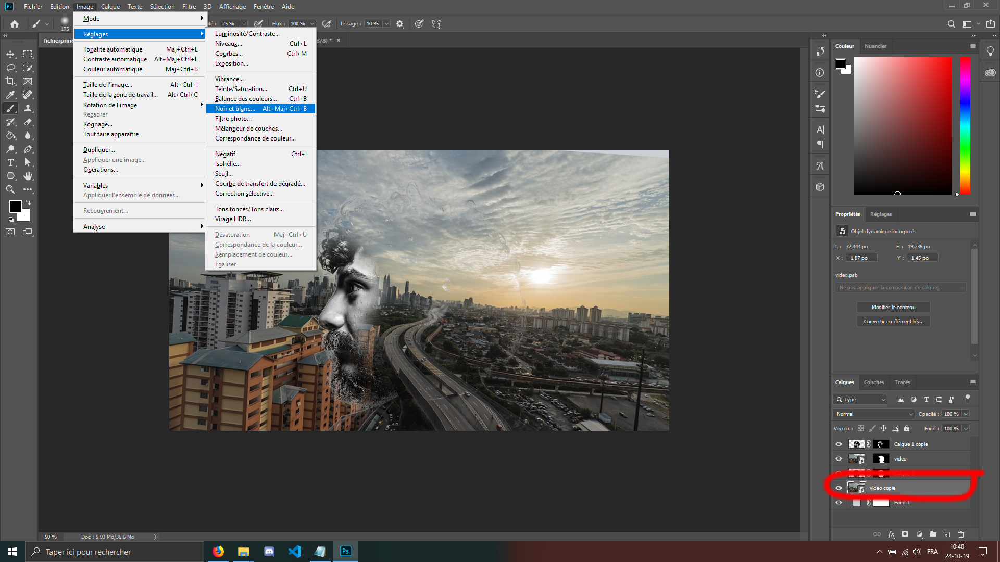
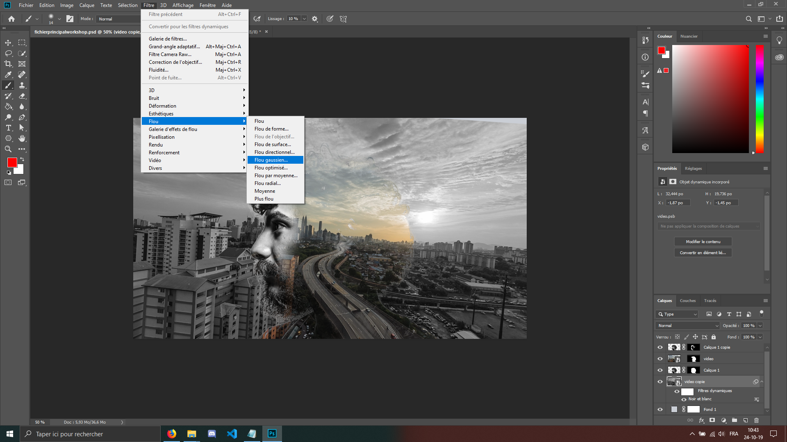
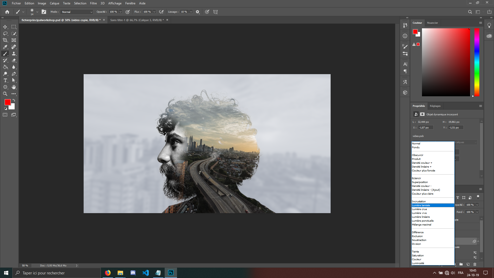
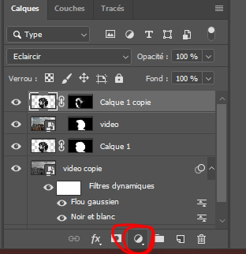
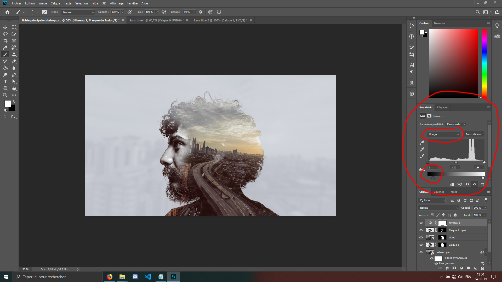
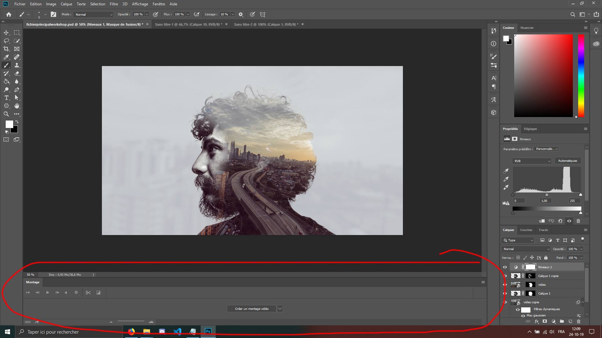

Maintenant vous allez faire une copie de la ville, en maintenant la touche alt et en faisant glisser le calque et placez la copie en dessous du calque 1 mais au dessus du fond. Supprimez le masque de fusion dessus en faisant un clic-droit -> supprimer le masque. 
Et enfin, allez dans image -> réglages -> noir et blanc. N'hésitez pas à user du ctrl+T pour que la ville
prenne bien tout le background.

 
 
 
 
Nous allons maintenant ajouter un flou gaussien, allez dans Filtre -> Flou -> Flou gaussien.

 
 
Choisissez un rayon de 9,0px pour votre flou.
Et enfin, mettez le blending mode(le menu à côté de 'opacité', au-dessus de vos calques) sur 'Lumière tamisée'

Vous pouvez ensuite mettre l'opacité sur 50%, je préfère, mais vous pouvez laisser tel quel. À chacun ses préférences.

Nous allons maintenant selectionner le premier calque de la liste, et aller comme tout à l'heure à droite de l'îcone du masque de fusion. Séléctionnez les 'niveaux'

 
 
 
 
Sur la petite fenêtre des niveaux qui s'est ouverte, nous allons cliquer sur le RVB, séléctionner le rouge
et rajouter un peu de rouge sur le calque, pour donner un peu plus de chaleur aux couleurs

Selectionnez le bleu, et faites la même chose ( jusqu'à ce que ça vous plaise ).
 
 
 
 
Nous allons donc enfin animer tout ça ! Allez dans fenêtre -> Montage pour faire apparaître la fenêtre de montage.

<a href="photoshop-readme/Ws-Ps-8.md">Pour l'animation, c'est pas ici -></a>