Cliquez sur 'créer montage vidéo' ce qui va vous ouvrir la timeline des différents calque. 
Comme vous pouvez le constater, la vidéo est bien plus longue que le reste de nos calques. Vous pouvez prendre le coin du premier calque plus long et le réduire à la taille des autres

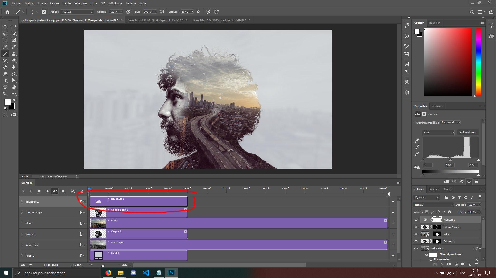

 
 
 
 
Maintenant, double cliquez sur la vidéo, ce qui va l'ouvrir dans une fenêtre indépendante.

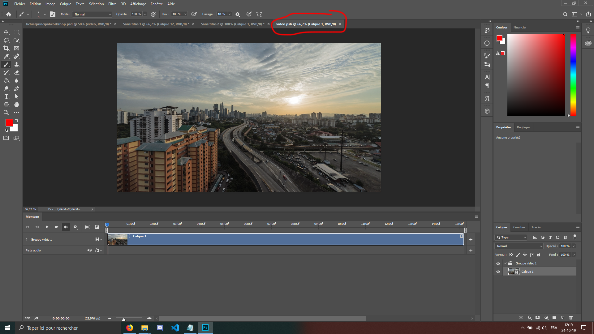

 
 
 
 
Nous allons ensuite faire en sorte que la vidéo tourne en boucle de manière fluide. 
La vidéo dure 15 secondes, ce qui est trop pour nous. On voudrait que ça ne soit que 5 secondes, donc dans un premier temps nous allons mettre notre vidéo a environ 9 secondes.

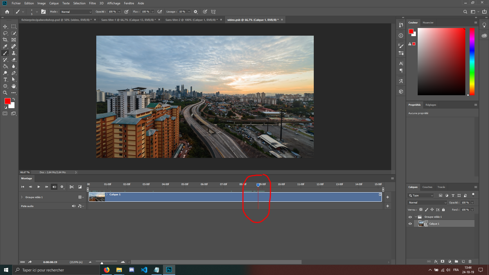

 
 
 
 
Ensuite nous allons réduire par la gauche vers l'endroit où nous nous sommes arrêté. Allez sur le "temps" en bas à gauche (double clic), et le set-up a 5 secondes.

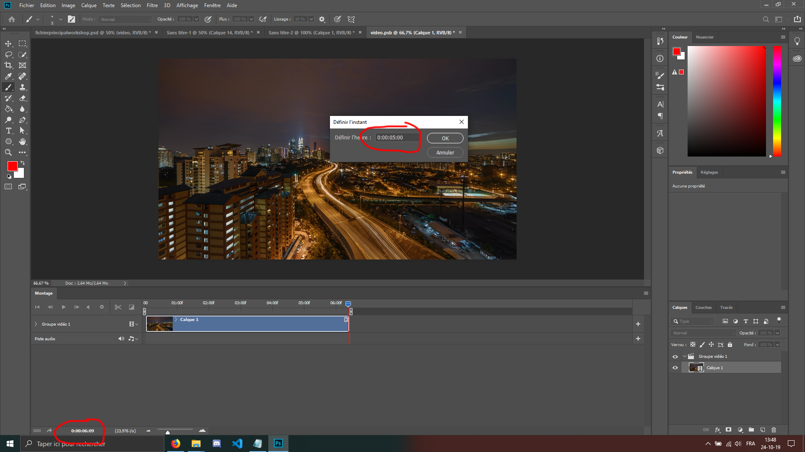

Une fois les 5 secondes validée, il y aura donc à droite de la ligne rouge le 'surplus' des 5 secondes. Réduisons le
à 5 secondes, en tirant le coin comme fait précédemment.
 
 
 
 
Ensuite, sur le 'groupe vidéo1' (situé au dessus de votre calque de vidéo) , clic-droit dessus -> dissocier les
calques. 
Nous allons ensuite faire une copie de la vidéo, pour ça il suffit de la glisser vers l'îcone 'nouveau calque'
situé en bas à droite de l'écran ( oui, encore et toujours en bas à droite ), ou simplement en le sélectionnant et en faisant un 'ctrl +j'.

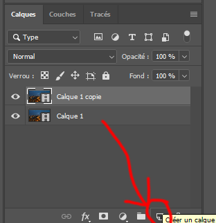

 
 
 
 
Nous allons donc maintenant aller vers le milieu de notre copie, et ensuite la cut !

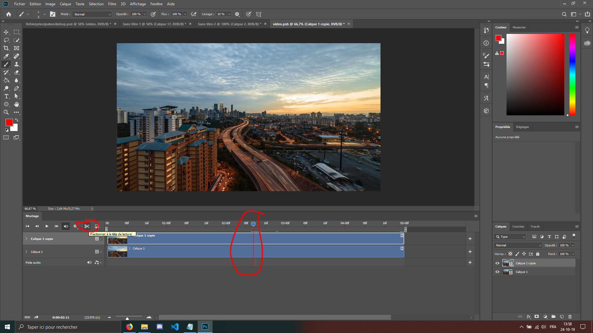

 
 
 
 
Après le cut vous devriez avoir 2 morceaux séparés de cette copie. Nous savons donc maintenant que la dernière frame
de notre première moitié va correspondre avec la première frame de la seconde moitié.
 
 
Nous allons ensuite inverser les deux moitiés, aller à la moitié de chacun d'entre eux et les réduire.

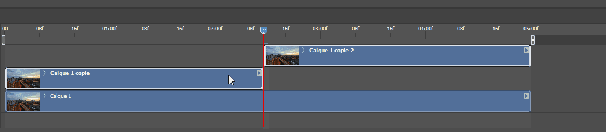

 
( désolé pour la lenteur du gif mais le pc ramait pas mal pendant que j'enregistrais l'écran.)
 
  
 
Nous allons ajouter une transition 'fondu' a la fin de notre premier morceau réduit, et un au début de notre second
morceau de vidéo.

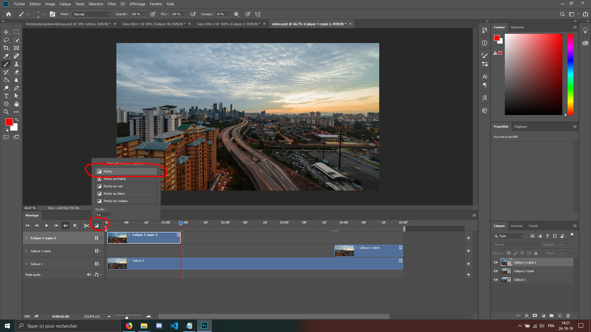

 
 
 
 
Et nous allons drag&drop le 'fade' vers la fin de notre premier morceau, et une seconde fois au début de l'autre.

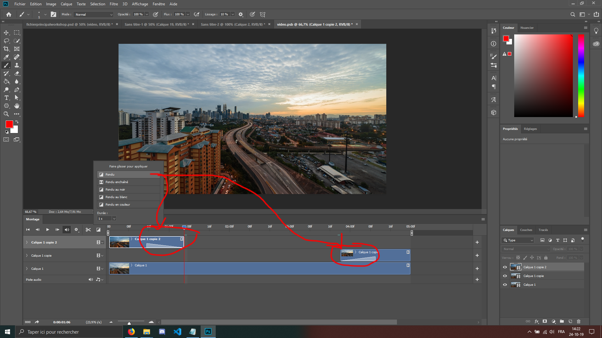

 
 
 
 

Ensuite, fermons l'onglet de la vidéo et **SURTOUT** lorsqu'il vous demande si vous voulez sauvegarder les changements
effectués sur la vidéo, vous mettez bien **EVIDEMMENT OUI**. Sinon, vous êtes bon pour recommencer :D
( attention que l'enregistrement peut prendre du temps, c'est normal ).

Et comme vous pouvez le voir, de retour sur notre montage, que la longueur de tous les calques est ajustée. Maintenant 
réglez la durée de la vidéo à 5 secondes, pour se faire vous allez au bout de la piste et vous faites un drag vers
les 5 secondes.

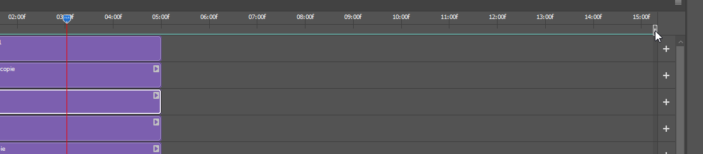

 
 
 
 
 
Maintenant, il est temps de le sauvegarder !
Pour se faire , Fichier -> exportation -> enregistrer pour le Web (hérité). 
 
Laissez bien le temps à Photoshop de process votre nouvelle création. Une fois le chargement fait, assurez vous de bien
être en format gif.
Le fichier est beaucoup trop grand, surtout pour un usage web...  
Vous voyez en bas à gauche de la fenêtre, vous devriez être à une taille d'environ 50Mo.
Pour se faire, nous allons réduire sa taille,par exemple 600px de large, pour déjà bien réduire son poids, ainsi que choisir l'option 'perception' en dessous de GIF et laisser diffusion en dessous. Vous pouvez décocher la transparence car il n'y en a pas sur notre Gif.  
Et enfin dans 'perte' vous pouvez mettre 10 à 20, cela permettra de réduire encore un peu sa taille.

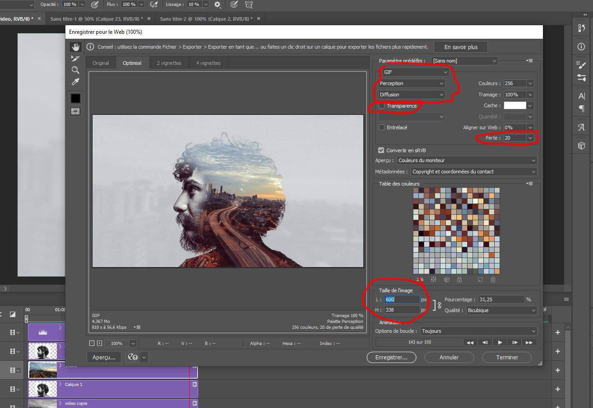

  

**Félicitations !** Vous venez de réaliser un super montage PhotoShop !
Nous espérons que ce workshop vous a bien plu ! Désormais vous pouvez laisser parler votre créativité et faire pleins de montages dans ce genre. Ou alors nous demander, à Massimo et Olivier, après d'autres 'Tuto photoshop' et nous vous aiderons avec plaisir !